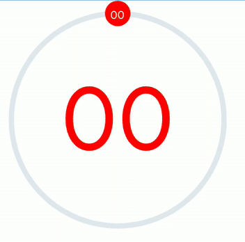
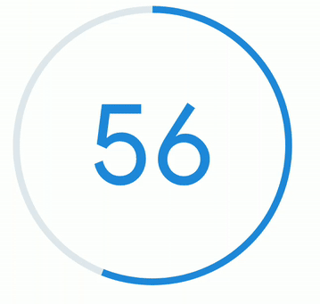
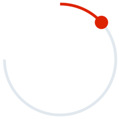

# React Native Arc Slider


## :rocket: Getting Started

### Install

- Install the library and react-native-svg

  ```bash
  npm i --save rn-arc-slider react-native-svg
  ```

- Link native code for SVG

  ```bash
  npx react-native link react-native-svg
  ```

### Usage

```jsx
import ArcSlider from "rn-arc-slider";
```

```jsx
<ArcSlider
  value={value}
  onChange={setValue}
  trackColor={"red"}
  showThumbText
  showText
/>
```

<table>
<tr>
<td>
  
</td>
<td>
Slider with Thumb
</td>
</tr>
<tr>
<td>

</td>
<td>
Progress Bar
</td>
</tr>
<tr>
<td>

</td>
<td>
Arc Slider without center text
</td>
</tr>
</table>

## :sparkles: Props

<!-- props-start -->

| Prop Name        | Type                     | Default   | Description                                             |
| ---------------- | ------------------------ | --------- | ------------------------------------------------------- |
| `trackRadius`    | number                   | `100`     | Radius of Circular Slider                               |
| `thumbRadius`    | number                   | `12`      | Size of Thumb                                           |
| `trackWidth`     | number                   | `5`       | Size of Track                                           |
| `value`          | number                   | `0`       | Value between minValue to maxValue                      |
| `minValue`       | number                   | `0`       | Minimum value                                           |
| `maxValue`       | number                   | `100`     | Maximum value                                           |
| `onChange`       | ((angle: number) => any) | `none`    | onChange Handler                                        |
| `trackColor`     | string                   | `#2089dc` | Color for Track                                         |
| `trackTintColor` | string                   | `#e1e8ee` | Color for Track Tint                                    |
| `thumbColor`     | string                   | `#2089dc` | Color for Thumb                                         |
| `thumbTextColor` | string                   | `white`   | Color for Text on Thumb                                 |
| `thumbTextSize`  | number                   | `10`      | Font size for Text on Thumb                             |
| `showThumbText`  | boolean                  | `false`   | Show text on center of thumb                            |
| `noThumb`        | boolean                  | `false`   | Show Thumb on Track                                     |
| `showText`       | boolean                  | `false`   | Show text on center of circle                           |
| `textColor`      | string                   | `#2089dc` | Text color for center of circle                         |
| `textSize`       | number                   | `80`      | Text Size for center of circle                          |
| `maxAngle`       | number                   | `359.9`   | Maximum arc angle in degrees i.e. its range is 0 to 359 |
| `minAngle`       | number                   | `0`       | Minimum arc angle in degrees i.e. its range is 0 to 359 |

<!-- props-end -->

## :handshake: Contribution

All PRs are welcome

## :memo: License

This project is under license from MIT. For more details, see the [LICENSE](LICENSE.md) file.

Made with :heart: by <a href="https://github.com/arpitBhalla" target="_blank">Arpit Bhalla</a>

&#xa0;

<a href="#top">Back to top</a>
